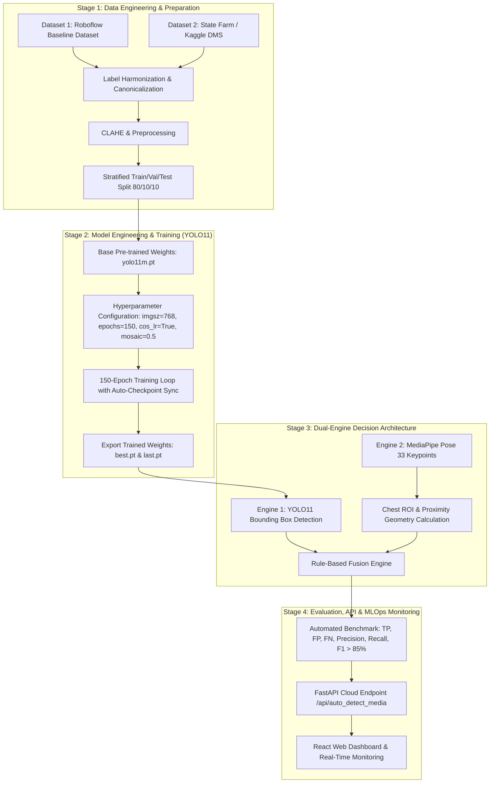

# Quy Trình AI Engineering & Deep Learning End-to-End: Driver Behavior Monitoring (DMS)

Tài liệu thiết kế hệ thống theo chuẩn **AI Engineering / MLOps** cho bài toán nhận diện hành vi tài xế (dùng điện thoại, thắt dây an toàn, hút thuốc) đạt mAP / F1-Score **> 85%**.

---

---

## 🏗️ Chi Tiết 4 Giai Đoạn Quy Trình (Phân Tách Theo Chuẩn AI Engineering)

### 1. Data Engineering (Kỹ Thuật Dữ Liệu)
* **Gộp đa nguồn dữ liệu (Multi-Source Ingestion)**:
  - Tải tập dữ liệu gốc từ **Roboflow Universe** (v9).
  - Tải tập dữ liệu mở rộng **State Farm Distracted Driver / DMS Safety Dataset** (trên Kaggle).
* **Chuẩn hóa nhãn (Label Harmonization)**:
  - Chuyển đổi toàn bộ các nhãn phụ (`cell-phone`, `mobile-phone`, `no seatbelt`, `cigarette`) về **4 nhãn chuẩn (Canonical Labels)**:
    1. `phone` (Dùng điện thoại)
    2. `smoking` (Hút thuốc)
    3. `seatbelt` (Thắt dây an toàn)
    4. `no-seatbelt` (Không thắt dây an toàn)
* **Tiền xử lý ảnh (Image Preprocessing)**:
  - Cân bằng độ tương phản bằng **CLAHE** và **Gamma Correction ($\gamma = 1.2$)** giúp làm nổi bật dây an toàn trong môi trường tối/ngược sáng.

---

### 2. Model Engineering & Training (Deep Learning YOLO11)
* **Base Model**: Sử dụng trọng số khởi tạo chuẩn `yolo11m.pt` (hoặc `yolo11s.pt`).
* **Cấu hình Hyperparameters tối ưu**:
  - `imgsz = 768`: Giữ nguyên chi tiết vật thể nhỏ/mảnh (dây an toàn, điện thoại).
  - `epochs = 150`: Huấn luyện đủ độ hội tụ.
  - `batch = 16`, `workers = 2`.
  - `cos_lr = True`: Áp dụng Cosine Annealing Learning Rate Scheduler giúp mô hình mịn hóa loss ở các epoch cuối.
  - `close_mosaic = 10`: Tắt Augmentation Mosaic ở 10 epoch cuối để viền Bounding Box đạt độ chính xác tối đa.
  - `mosaic = 0.5`, `mixup = 0.1`, `hsv_s = 0.7`, `hsv_v = 0.4`.

---

### 3. Decision Engineering (Dual-Engine: YOLO11 + MediaPipe Pose Chest ROI)
Điểm đột phá của công trình 2025/2026 là **kết hợp 2 mô hình (Dual Engine)**:
* **Engine 1 - YOLO11 Object Detector**: Trích xuất Bounding Box vật thể (`phone`, `smoking`, `seatbelt`, `no-seatbelt`).
* **Engine 2 - MediaPipe Pose Keypoints**: Trích xuất 33 điểm mốc cơ thể:
  - $LS$ (`LEFT_SHOULDER`), $RS$ (`RIGHT_SHOULDER`), $LH$ (`LEFT_HIP`), $RH$ (`RIGHT_HIP`).
  - **Vùng Ngực (Chest ROI)** được tính theo đa giác nối từ 2 vai đến 2 hông.
  - Bounding box `seatbelt` / `no-seatbelt` buộc phải cắt qua Chest ROI.
  - Điện thoại (`phone`) chỉ kích hoạt vi phạm khi khoảng cách tới Cổ tay ($WRIST$) hoặc Tai/Mũi ($EAR$/$NOSE$) nhỏ hơn ngưỡng khoảng cách $R$.

---

### 4. MLOps, Evaluation & Continuous Deployment
* **Đánh giá tự động**: Chạy script benchmark tính ma trận nhầm lẫn (Confusion Matrix):
  $$\text{Precision} = \frac{TP}{TP + FP}, \quad \text{Recall} = \frac{TP}{TP + FN}, \quad F1 = 2 \cdot \frac{\text{Precision} \cdot \text{Recall}}{\text{Precision} + \text{Recall}}$$
* **Tích hợp FastAPI & React**:
  - Endpoint `/api/auto_detect_media`: Xử lý mượt file tải lên và stream webcam.
  - Endpoint `/api/evaluation_metrics`: Trả về trực tiếp ma trận đánh giá hiệu năng lên Dashboard.
